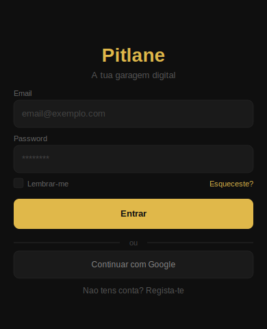
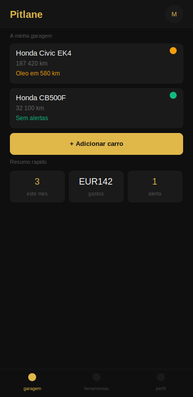
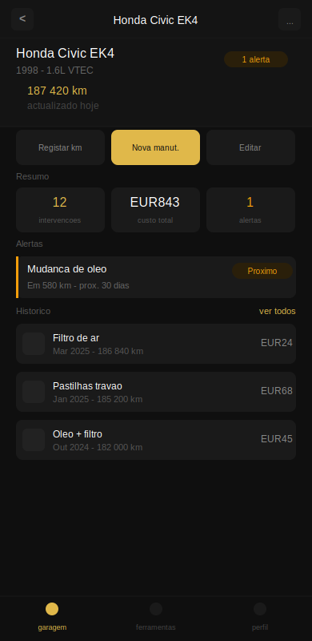
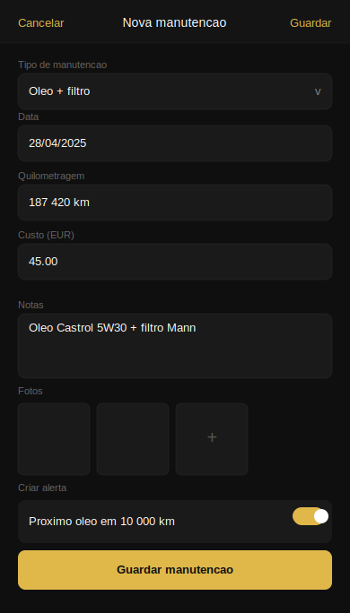
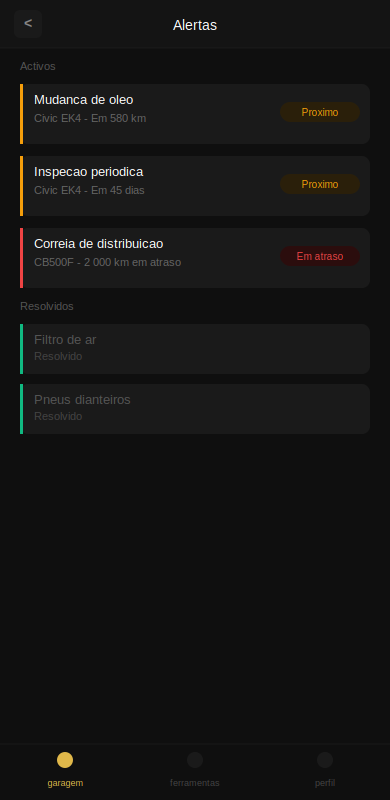
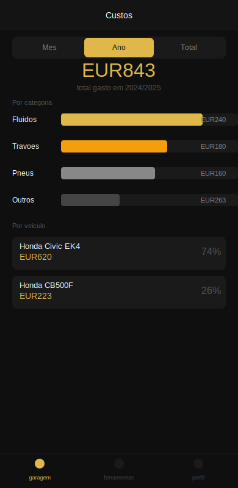

# Pitlane 🔧

> Car maintenance tracking app — know your car, own your maintenance.


---

## What is Pitlane?

Pitlane is a mobile-first car maintenance management app built for DIY enthusiasts who want a centralised, structured record of everything they do to their vehicles.

Track maintenance history, set km and date-based alerts, log costs, manage your tools, and never miss a service again — all in one place, designed to be used in the garage with dirty hands.

> Personal project built to learn Java and Spring Boot, transitioning from a C#/.NET background. Designed and developed end-to-end as a portfolio piece.

---

## Screenshots

| Login | Dashboard | Vehicle |
|-------|-----------|---------|
|  |  |  |

| New Maintenance | Alerts | Costs |
|----------------|--------|-------|
|  |  |  |

---

## Stack

| Layer | Technology |
|-------|-----------|
| Backend | Java 21 + Spring Boot 3 |
| API | REST + Spring MVC |
| Security | Spring Security + JWT + Google OAuth 2.0 |
| ORM | Spring Data JPA + Hibernate |
| Migrations | Flyway |
| Database | PostgreSQL 16 |
| Frontend | React 18 + Vite + React Router |
| Storage | AWS S3 / Cloudflare R2 |
| DevOps | Docker + Docker Compose |
| API Docs | Swagger / OpenAPI 3 |
| Version Control | Git + GitHub |

---

## Features

### Implemented
- [ ] User authentication (register, login, JWT refresh, Google OAuth)
- [ ] Garage management with multiple vehicles
- [ ] Maintenance history per vehicle
- [ ] Mileage tracking with history
- [ ] Alert system by km and by date
- [ ] Photo uploads per maintenance (before/after, receipts)
- [ ] Cost tracking with dashboard by category and vehicle
- [ ] Equipment management shared across vehicles
- [ ] Guest mode with local temporary data

### Planned (v2)
- [ ] YouTube tutorial search by vehicle + maintenance type
- [ ] Part price search across multiple stores
- [ ] Push notifications
- [ ] Desktop web version
- [ ] PDF report export

---

## Project Structure

```
Pitlane/
├── backend/                    # Spring Boot application
│   └── src/main/java/com/pitlane/
│       ├── controller/         # REST endpoints
│       ├── service/            # Business logic
│       ├── repository/         # JPA repositories
│       ├── model/              # JPA entities
│       ├── dto/                # Request / response objects
│       ├── config/             # Security, Swagger, S3 config
│       └── exception/          # Global error handling
│
├── frontend/                   # React + Vite application
│   └── src/
│       ├── pages/              # Route-level components
│       ├── components/         # Reusable UI components
│       ├── hooks/              # Custom React hooks
│       ├── services/           # API calls
│       └── context/            # Auth context
│
├── docs/                       # Project documentation
│   ├── screens/                # App screenshots
│   ├── wireframes/             # Low and high fidelity wireframes
│   └── architecture/           # Architecture decisions
│
└── docker-compose.yml          # Local development environment
```

---

## Running Locally

### Prerequisites

- Java 21+
- Node.js 18+
- Docker + Docker Compose

### 1. Clone the repository

```bash
git clone https://github.com/Maravillz/Pitlane.git
cd Pitlane
```

### 2. Configure environment variables

Copy the example env file and fill in the values:

```bash
cp .env.example .env
```

```env
# Database
POSTGRES_DB=pitlane
POSTGRES_USER=pitlane
POSTGRES_PASSWORD=your_password

# JWT
JWT_SECRET=your_secret_key_min_256_bits
JWT_EXPIRATION_MS=604800000
JWT_REFRESH_EXPIRATION_MS=2592000000

# Google OAuth
GOOGLE_CLIENT_ID=your_google_client_id
GOOGLE_CLIENT_SECRET=your_google_client_secret

# S3 / R2 Storage
STORAGE_ACCESS_KEY=your_access_key
STORAGE_SECRET_KEY=your_secret_key
STORAGE_BUCKET=pitlane
STORAGE_ENDPOINT=https://your-r2-endpoint.r2.cloudflarestorage.com
```

### 3. Start the services

```bash
docker-compose up -d
```

This starts:
- **PostgreSQL** on `localhost:5432`
- **Adminer** (database UI) on `localhost:8081`

### 4. Start the backend

```bash
cd backend
./mvnw spring-boot:run
```

Backend runs on `http://localhost:8080`

### 5. Start the frontend

```bash
cd frontend
npm install
npm run dev
```

Frontend runs on `http://localhost:5173`

### 6. Access the app

| Service | URL |
|---------|-----|
| App | http://localhost:5173 |
| API | http://localhost:8080 |
| Swagger UI | http://localhost:8080/swagger-ui.html |
| Adminer | http://localhost:8081 |

---

## API Documentation

The REST API is fully documented with Swagger / OpenAPI 3.

After starting the backend, visit: `http://localhost:8080/swagger-ui.html`

Main endpoint groups:

| Group | Base path |
|-------|-----------|
| Auth | `/api/auth` |
| Vehicles | `/api/vehicles` |
| Maintenances | `/api/maintenances` |
| Alerts | `/api/alerts` |
| Equipment | `/api/equipment` |
| Stats | `/api/stats` |
| Users | `/api/users` |

---

## Architecture Decisions

Key decisions made before development:

- **Java + Spring Boot** — returning to the language where my programming foundations were built, and the industry standard for Java backend
- **PostgreSQL** — relational data model fits naturally (users → vehicles → maintenances → alerts)
- **Flyway** — versioned schema migrations, always in sync with code
- **JWT** — stateless auth, scales horizontally without server-side session state
- **Docker Compose** — single command to spin up the full local environment
- **React + Vite** — familiar frontend framework, modern tooling, focused on backend as the differentiator

Full architecture decisions document in `docs/architecture/`.

---

## License

MIT — free to use, learn from, and build upon.

---

*Built with Java 21, Spring Boot 3, React 18 and PostgreSQL — April 2025 by [Miguel Maravilhas](https://linkedin.com/in/miguel-fmsilva)*